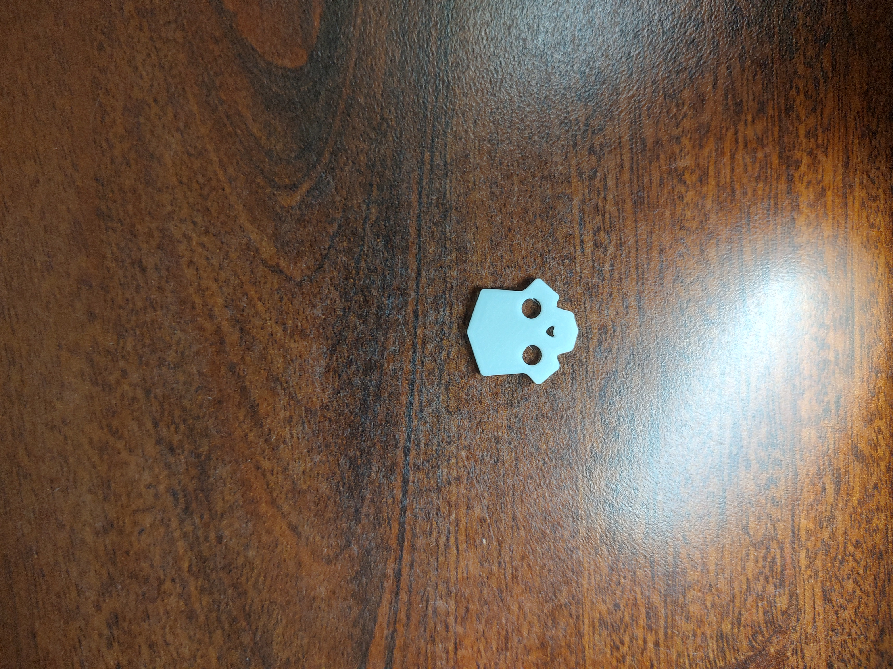
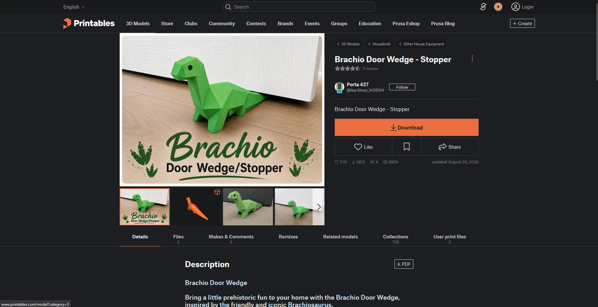
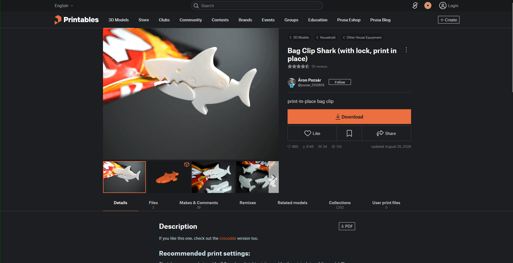
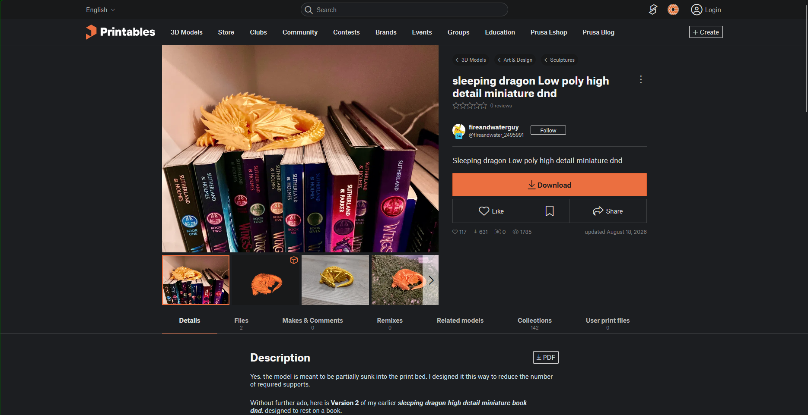
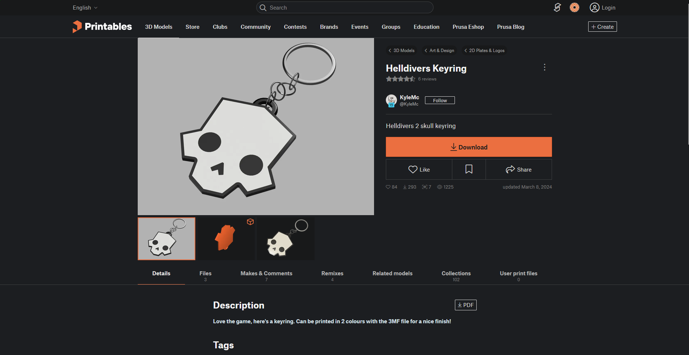
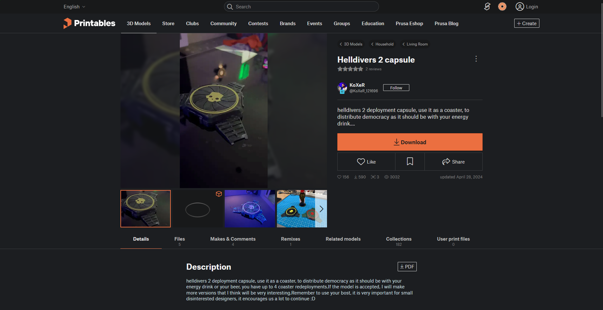
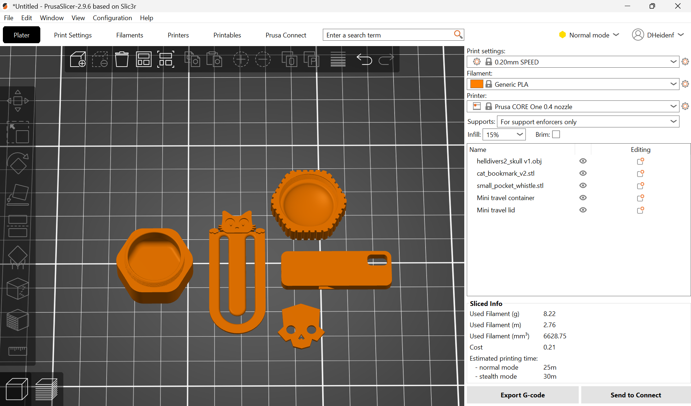
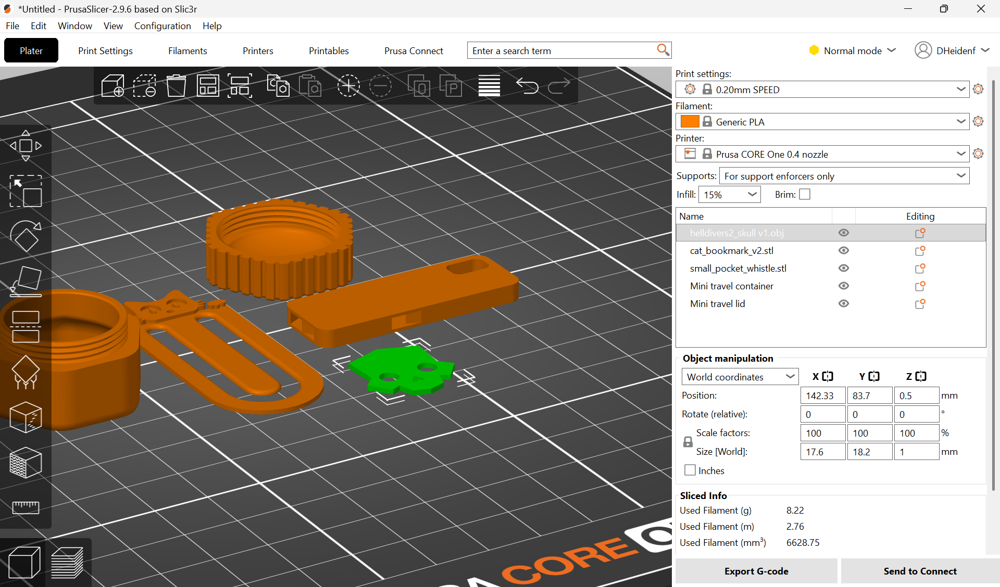
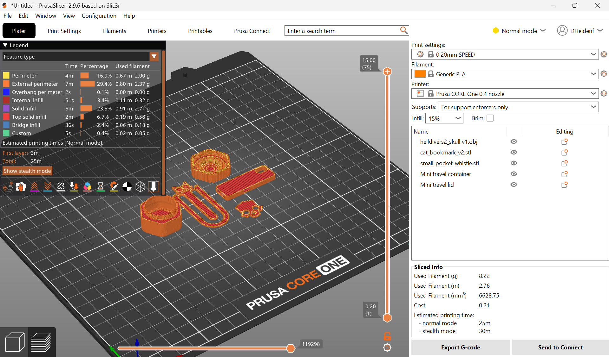
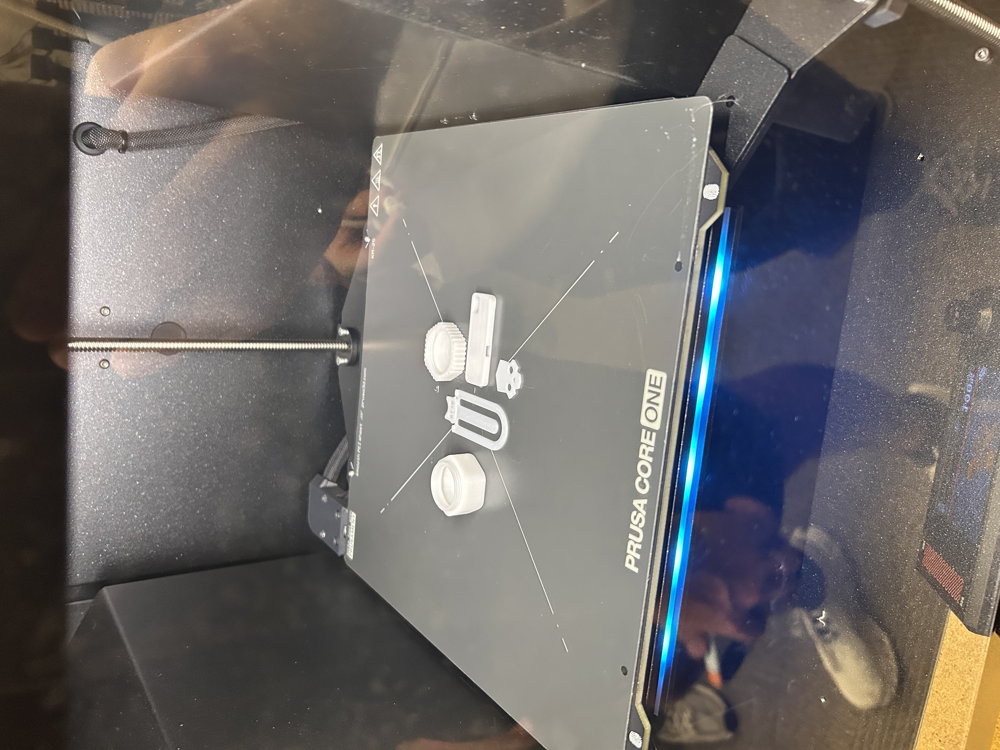

# A3 – Lab 2: Print Something Small

## Download

The objective of this lab was to print a small object that was downloaded from the [Printables Website](https://www.printables.com/). The small object I chose was the *skull logo from the videogame Helldivers 2*. Videogames are a big hobby of mine and I've always liked collecting or creating small memorabilia from my favorite games or interests. The STL file was downloaded directly from the Printables Website and imported into the Prusa Slicer.

The Keyart for Helldivers 2

The finished Print of the skull logo.

----------------------------------------------------------

There were several different models I looked at, both on the homepage and searching for models pertaining to other games.

**The models from the homepage I was deciding between:**

[Brachio Door Wedge](https://www.printables.com/model/1806678-brachio-door-wedge-stopper)

[Bag Clip Shark](https://www.printables.com/model/1798894-bag-clip-shark-with-lock-print-in-place)

[Sleeping Dragon Figure](https://www.printables.com/model/1814618-sleeping-dragon-low-poly-high-detail-miniature-dnd)

**Other Helldivers 2 Models:**

[Helldivers Keychain](https://www.printables.com/model/797679-helldivers-keyring)

[Helldivers 2 Capsule](https://www.printables.com/model/861029-helldivers-2-capsule)

## Preprocessing

In order to prep the model to be printed, it needed to be loaded into the Prusa slicer and sliced. There wasn't as much alteration needed despite the image on the Printables Website displaying the model standing up. However, once the STL was loaded into the slicer, it was resting on one of the flat faces. The model was already very small with dimensions 18.7 x 18.2 x 1 mm (about 0.73 x 0.73 x 0.04 inches), which was well within the 2 x 2 x 0.25 inch constraints meaning no scaling was needed. Due to the models very flat form, no supports were needed either and it could be printed as is. The big thing to keep track of was the fact that the printer used had PLA loaded into it versus PETG meaning the right setting had to be selected. The Helldivers 2 Skull Logo model alone took approximately one minute to print. However, the total print time for all of the models from my team was about twenty-five minutes. 

All four models laid out on the Print bed.

Dimensions of the Model.

The models sliced

## Printing

My team was composed of myself: Derek Heidenfelder, Brendan Spinner, Nathan Jablonski, and Luz Ramos Saturnino. We each chose very different models but we tried to keep the print time down and managed to get a twenty-five minute print time. However, the true time was longer due to the printer needing to heat up and the first lay took three minutes to print. 

<video width="100%" controls>
  <source src="docs/Labs/L03/A02-Vid-Early.mov" type="video/mov">
Your browser does not support the video tag.
</video>

The printer starting on the models.

<video width="100%" controls>
  <source src="docs/Labs/L03/A02-Vid-Late-Cut.mp4" type="video/mp4">
Your browser does not support the video tag.
</video>

The printer nearly finished with the the models

The models finished printing

The Printer screen showing the print is finished.

## Lessons Learned

There were many lessons learned during the process of printing a small object specifically on a Prusa Core One printer. Having had experience with 3D printers before, I had an idea of how to navigate the Printables website and Prusa Slicer. That being said, every slicing software is slightly different, so I still had to learn about the details of the Prusa Slicer and how to navigate the menus. I had to also learn how to import multiple STL files and arrange them in the slicer to print all four of my teams' models. Exporting the G-Code onto a USB drive to then be able to import the G-Code into the printer was something I had little experience doing. With the Prusa Core One printer, one of the most interesting things I learned was the internal heating chamber. The printer heats up the entire print chamber which allows the print bed and nozzle to heat up faster. The differences between PETG and PLA filament was one of the most important things I learned. Since the filaments are different, the printer and slicer have different settings for both. And using the wrong setting doesn't end well, so I now know to double check what filament the printer has loaded so as to not make a mess.

## Resources

[Printables Website](https://www.printables.com/)

[Brachio Door Wedge](https://www.printables.com/model/1806678-brachio-door-wedge-stopper)

[Bag Clip Shark](https://www.printables.com/model/1798894-bag-clip-shark-with-lock-print-in-place)

[Sleeping Dragon Figure](https://www.printables.com/model/1814618-sleeping-dragon-low-poly-high-detail-miniature-dnd)

[Helldivers Keyring](https://www.printables.com/model/797679-helldivers-keyring)

[Helldivers 2 Capsule](https://www.printables.com/model/861029-helldivers-2-capsule)

[Helldivers 2 Keyart Image Source](https://helldivers.wiki.gg/wiki/Helldivers_2)
