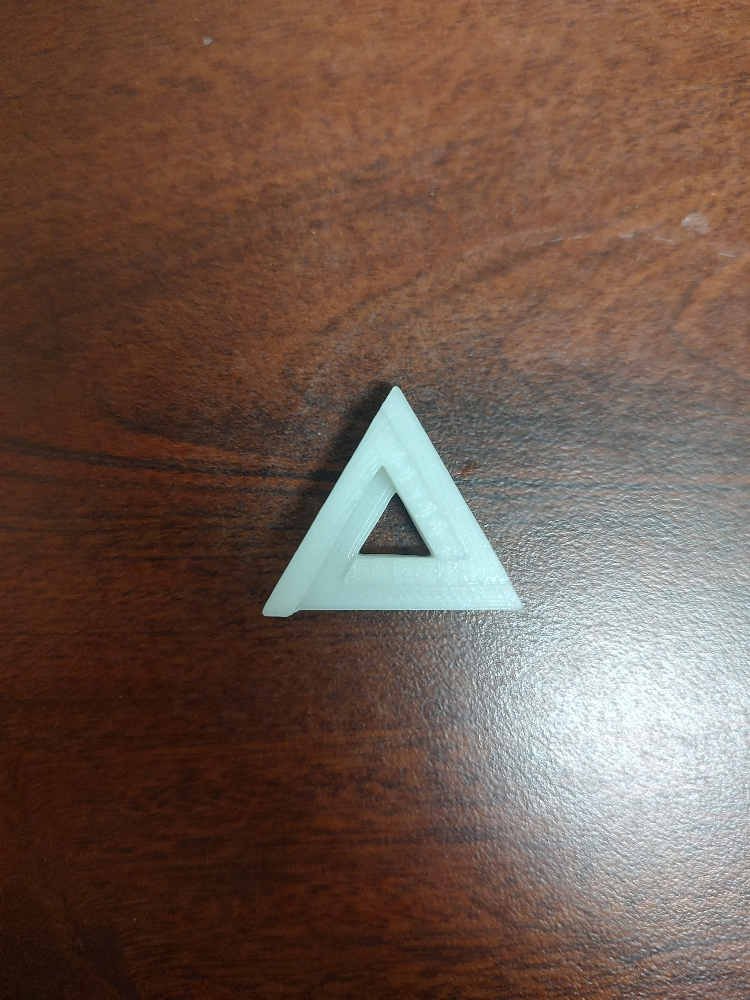

# A4 – Design Something Small

## Objective

The goal of the third lab was to design and then print a small object of our choosing. 

I chose to design the Penrose Triangle, otherwise know as the Impossible Tribar. 

[Penrose Triangle](https://en.wikipedia.org/wiki/Penrose_triangle)

The Penrose Triangle is an optical illusion that depends entirely on being able to view the object from a certain perspective in 3 dimensions. However, the assignment limited the height of the designed object to be less than 0.5 inches tall and no more than 1.5 x 1.5 inches. I challenged myself to see if I could recreate a 3 dimensional optical illusion while keeping a similar effect. 

## Infill and Wall Thickness Research

**Stars Infill**

The Stars Infill pattern is made from the triangles infill pattern but shifted slightly to create six pointed stars. The Star Infill is closest to a mix between the triangles and honeycomb infill patterns and offers similar strength and material consumption to both. The only benefit I have found as to why one should use the Stars Pattern over the triangles or honeycomb patterns is for aesthetic reasons. The Stars Infill offers a more unique pattern but is practically the same in material cost and strength.

**Hilbert Curve Infill**

The Hilbert Curve Infill Pattern is one of the most unique infill patterns which utilizes a procedurally generated Hilbert Curve or Hilbert Space Filling Curve which is a continuous fractal space filling curve. The infill pattern ends up looking like a labyrinth made up of the infill lines. The Hilbert Curve infill has a very good strength to material use ratio that studies have found. Hilbert Curve infill is also good if the print is going to be filled with a liquid such as resin as it creates a continuous path to every section of the infill.

**Line Infill**

The Line Infill Pattern is very similar to the Cubic infill except the Line pattern uses parallel lines that have acute angles between them. The lines are printed such that there are no crossing lines printed in one layer versus every line being printed with the cubic pattern. This can help material not build up on the nozzle or the intersections of the lines since the lines never cross on the same layer. Depending on the application, the extra material built up from the cubic infill might cause issues which the line pattern solves.

**How does percentage infill affect mechanical properties?**

Different infill percentages affect mechanical properties in multiple ways. A higher infill percentage means more infill. This increases structural stability and rigidity but increases print time. Lower infill percentages have lower stabilty and higher flexibility and a quicker print time which is beneficial for some use cases.

**How do different infill patterns affect mechanical properties?**

Different infill patterns directly affect mechanical properties by changing the structural stabilty and rigidity. Some infill patterns are good for a quick print that isn't needed for a structural use case while some are better for flexibility and more use case specificy critera. 

**Wall thickness** is vital to the structural stability of a 3D print. While the infill helps hold the structure together and gives it strength and flexibility, The outer walls provide the shape, give the infill and surfaces something to attach to, and is the first defense against external forces that act on the print. A higher wall thickness or more vertical wall layers create a more rigid structure that is more structurally secure. A print with thicker walls can withstand more force before breaking but does not like being bent or flexed. A thinner wall thickness or less vertical wall layers provides the opposite effect. The print will not have as good structural stability but will be able to flex more without snapping. The wall thickness depends entirely on the application and whether the structure should be structurally secure or able to be flexed.

**Why use different wall thicknesses?**

Wall thickness is vital to the structural stability of a 3D print. Generally, structural uses need thicker walls to better withstand the forces they are subjected to. If the structural element needs to remain rigid, thicker walls help the model to hold its shape. Thinner walls are good for a faster print and flexibility. While not providing much structural integrity, for something that isn't being exposed to external forces or needs to flex some, thinner walls generally perform better and provide a shorter print time.

## Design

When starting the design in Solidworks, I figure it was going to be very easy. I was just going to have three different heights on the edges to try and mimic the rectangular prisms that the Penrose Triangle is composed of. I also wanted the edges to be angled to even further try and mimic the shape but I would later run into difficulties and would have to rethink things.

To start, I made a 2D sketch of a triangle with a smaller triangle in the center for the cutout and extruded that up. I went for a more subtractive modeling approach over an additive one. 

* The important thing I had to keep in mind was keeping the middle triangle equidistant from the edges of the outer triangle. I did this by using smart dimensions and constraints so the middle triangle would be perfectly in the center of all the edges of the outer triangle. 

To split each section of the triangle in half, I used a bunch of midpoint lines so I would be able to get the exact center. 

Using the construction lines as I guidance, I could then extrude cut half of the edges to try and mimic the illusion of the Penrose Triangle using depth.

At this point, I decided to abandon the idea of making the edges slanted relative to each other to make them look like rectangular prisms. However, I did want the edges to look like they tapered off into each other and appear to disappear behind each other.

However, I would quickly run into the reoccurring issue of this design, that being: weird angles. Everything was on a weird angle which made it very difficult to do anything geometrically. And I couldn't figure out how to make reference planes work with the angles. 

* The moment I figured out these angles would cause me a massive headache.

I decided to keep the sketches on the outside edges because while the slants wouldn't be straight, it would at least be more consistent than trying to go from the end. 

I didn't like the flat surface that was created at the corner so I tried redoing the sketches in the opposite order to make the edges and slants fit together better.

However, this created a lip where the two slants meet that I also didn't like. 

I messed around with cut extrudes for a long time before I got to this which I was satisfied with. I also was spending too much time on this single corner and knew I had to move on. I worked on making the same slope on the other edges. 

* Here I raised the height of the sketch because if I had left it with the corners being coincident, I would have ended up with a flat face again. I tried to raise it to the height which would create a clean intersection between the edges when cut.

I decided to leave the lowest edge alone, because the lowest edge being flat worked with the perspective. Also, trying to get an extrusion in there would've been more difficulty than it was worth.

Instead, I came back to the idea of have the edges slanted slightly along the length. To do this, at the corners, I would extrude cut a small piece out so that I could work on the edge at a 90 degree angle. That way, when I made a sketch to cut out the angle, it would actually be straight relative to the edge.

* I went back and made it so the whole edge would be slanted rather than just half.

I tried to do the same thing on the lower edge. However, I foresaw it not going well and decided to move on to the upper edge.

I repeated the same process on the upper edge and then I used sketches and extrudes to rebuild the corners I cut out. Afterwards though, I realized that I could've left the corners cut out since the Penrose Triangle has flat corners, but it didn't occur to me at the time. 

The weird angles made filling in the corners more annoying than it should have been but with a little trial and error, I got the corners filled in.

With that, I called the design finished and moved it into the slicer for printing and preprocessing. 

## Preprocessing

Once I finished with the design of the Penrose Triangle, I loaded the STL file into the Prusa Slicer. I had designed it to lay flat on the print bed so no change of orientation would be needed.

The Penrose Triangle at the default size I made it was very small. It would've only taken four minutes to print with all of the default parameters. 

I decided to scale it up by a factor of about 150% to make it a little more substantial and closer to the maximum parameters I could. This way, more infill would be needed and I would have more room to mess with the parameters. I mostly focused on not letting the height go over the max of 0.5 inches or 12.7 millimeters. I scaled it up so the height would be about 9 millimeters instead of 5 mm. 

This increased the print time for 4 minutes to 7 minutes and increased the time of the first layer by about 10 seconds. However, this was still with the default parameters. I needed to change the infill and wall thickness. 

I increased the vertical wall thickness from the minimum of two shells to three shells. I wanted to make sure that the outside walls would have decent strength and be able to hold it's shape. I changed the infill from the default grid pattern to the stars pattern. The star pattern intrigued me because I had never seen it before using the Prusa Slicer and, after having researched it, it sounded like a good mix of the structural integrity and flexibility that were given by the triangle and honeycomb fill patterns. I increased the fill density to 25% to make sure there was enough for the surfaces to adhere to. 

With the final changes made, the print time was still around 7 to 8 minutes with 36 seconds for the first layer.

## Printing

The Penrose Triangle was sliced and the GCode was exported onto a USB Drive to be loaded onto the printer. The printing went smoothly and there were no issues. The print use PLA and was printed on printer 3. 

* The Print Preview

<video width="100%" controls>
  <source src="docs/Labs/L04/Penrose-Print-Vid-1-Cut.mp4" type="video/mp4">
Your browser does not support the video tag.
</video>

[Click here to view video if it doesn't load automatically](Penrose-Print-Vid-1-Cut.mp4)

* The Printer starting on the model, beginning the infill.

* The printer about 25% done.

<video width="100%" controls>
  <source src="docs/Labs/L04/Penrose-Print-Vid-2-Cut.mp4" type="video/mp4">
Your browser does not support the video tag.
</video>

[Click here to view video if it doesn't load automatically](Penrose-Print-Vid-2-Cut.mp4)

* The Print Finishing

The finished model turned out better than I expected. The size of the model helped hide a lot of the seams I wasn't happy with and while the illusion isn't really there, you can tell what it's going for. Overall, I was very pleased with the end result. 

## Lessons Learned

This design project was a good exercise in trying to use a CAD software to design something that had weird angles and strange overlapping geometry. Learning how to use reference planes would've likely solved most of my problems. However, I chose to use trial and error regarding the order of extruded cuts and the surfaces on which I cut to achieve a design I was satisfied with. A constructive method might've been better too, but that wouldn't eliminate the weird angles. I did learn that I overestimated the scale of what I made. A lot of the finer angles and details are mostly lost in the 3D print due to the printer printing in a very geometric way. It lessons the visibility and details of the angles meaning a lot of the work was I put in was rendered obsolete when it was printed but the effort was still worth it to learn my limitations with CAD software and especially Solidworks. Learning about infills and wall thicknesses also taught me a lot about the use cases for different wall and infill parameters while also demonstrating to me once again the flexibility of 3D printing and additive manufacturing.

The modeling process of the Penrose Triangle took around 6 hours.

## Infill Questions

**What would happen if you scaled this decision up? If your infill percentage or wall thickness choice were applied to a structural or safety-critical part instead of a small desk object, what would the consequences of getting it wrong be?**

The parameters I chose mostly applied to the small print I was making. 3 layers of walls works fine for a small print but would not at all be advisable for something bigger, especially if it had a structural use. The same thought process was used for the infill. I knew it was a small print and I also wanted it to take less than 10 minutes due to the limited class time. Something larger and structural would necessitate a higher infill percentage than what I chose for my small design. The consequences of getting it wrong could be disastrous, mainly because an insufficient structural stability could put people in danger if it were to break.

**What mistake did you catch, and what mistake might you not have caught? Detail an error you found and fixed. Then, more importantly: what's one flaw in your design or process that could have gone to print undetected, and what would need to change (in your process, not just this part) to catch it next time?**

I caught most of the mistakes I made with the angles I was trying to achieve. There was a lot of working with weird angles in this print and I had to keep track of and it's likely I missed one. There is probably also a lip or dimension I missed that I didn't notice. However, I try my best to double check and make sure everything is correct but there is still likely something I missed.

**How does this connect to a real product decision? Identify a consumer or industrial product where infill strategy, wall thickness, or material choice affects user safety (it doesn't have to be 3D printed). Briefly explain the parallel.**

Houses and buildings have a similar process of creating what is essentially infill in the form of studs inside walls to give the building better structural stability and shape. Generally, while building a house, a thickness of wood to use for the walls is decided upon based on the size of the house and what will be inside. Then, studs and floor joists are put in to give shape to the floors and walls while providing more structure and stability. 3D printing with infill and wall thickness uses the same thought process, taking into account the forces the print will be subjected to and using that determine the best wall thickness and infill for the print.

## Resources

[Penrose Triangle](https://en.wikipedia.org/wiki/Penrose_triangle)

[Prusa 3D Infill Patterns](https://help.prusa3d.com/article/infill-patterns_177130)

[3D printing infill patterns to save time, material and money](https://realvision.pro/2022/10/05/3d-printing-infill-patterns/)

[Hilbert Curve](https://en.wikipedia.org/wiki/Hilbert_curve)

[Path planning for the infill of 3D printed parts utilizing Hilbert curves](https://www.sciencedirect.com/science/article/pii/S235197891830221X)

[Infill in 3D Printing: Definition, Main Parts, and Different Types](https://xometry.pro/en/articles/3d-printing-infill/)

[What is the Strongest Infill Pattern?]( https://theprintedfuture.com/what-is-the-strongest-infill-pattern/)

[The effects of infill patterns on the mechanical properties of 3D printed PLA parts fabricated by FDM](https://www.researchgate.net/publication/359334862_The_effects_of_infill_patterns_on_the_mechanical_properties_of_3D_printed_PLA_parts_fabricated_by_FDM)

[Designing Wall Thickness for 3D Printing: Minimums, Maximums, Best Practices](https://bigrep.com/posts/designing-wall-thickness-for-3d-printing/)

[Wall Thickness in 3D Printing: Recommendations, Minimum and Maximum Values](https://www.raise3d.com/blog/3d-printing-wall-thickness/)

