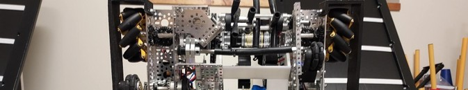

# Derek Heidenfelder — MEGR 2157 — Design Laboratory Portfolio

_Image of my Robotics teams' robot_

I am a mechanical engineering student at UNC Charlotte. This is my portfolio for the Spring 2026 MEGR 2156 Design Projects I Labs. This portfolio will document all of the projects I worked in the class and the processes, design principles, and thought processes behind each project. Since I am in the 3D section of the lab, the projects will primarily consist of the 3D models I will be designing over the course of the semester. This includes projects I will have 3D printed with either SLA or Resin printers, as well as laser cutting.

[About Me](aboutme/index.md)

---------------------------------------

## This portfolio is organized into the different assignments and projects that will be completed throughout the semester.

[Lab Project List](portfolio-overview.md)

---------------------------------------
[Resume](Resume_DerekH_2026_Scholarship_Resume.pdf)

